<table>
  <tr>
    <td width="50%"></td>
    <td width="50%"></td>
  </tr>
</table>

### Featured Repos

- **[tuon-ai](https://github.com/worriee/tuon-ai)** — AI learning assistant: multi-model notes & quizzes
- **[uveworkflow](https://github.com/worriee/uveworkflow)** — structured AI coding workflow with memory + personas
- **[pi-worrie](https://github.com/worriee/pi-worrie)** — personal Pi CLI extensions, semi-automated UVE
- **[SimpleNoteApp](https://github.com/worriee/SimpleNoteApp)** — Android app: YouTube videos → Gemini study notes
- **[web-loaderbyjimzxworrie](https://github.com/worriee/web-loaderbyjimzxworrie)** — PWA data-loading app, Supabase + Redis
- **[StudyHub-Progress](https://github.com/worriee/StudyHub-Progress)** — study marketplace desktop app, college project

### About Me

> _"slow but curious."_

I build web and applications (PWA) with AI integration, and I make semi-automated tools to build/improve my agentic workflow.
